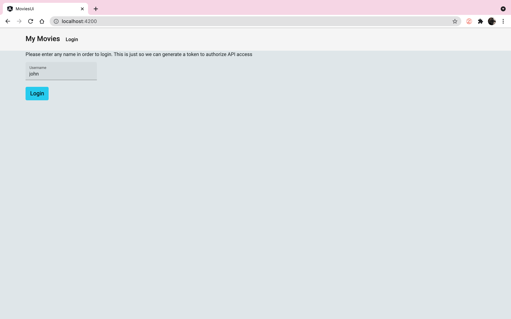
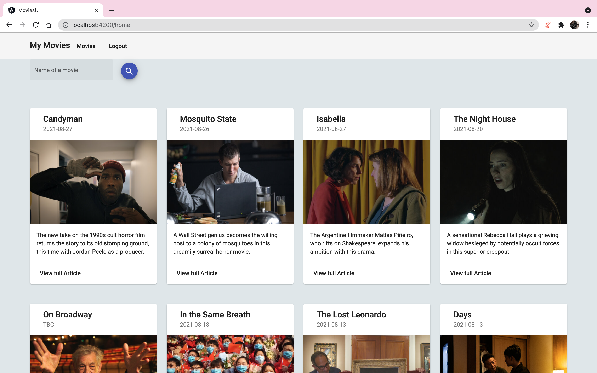
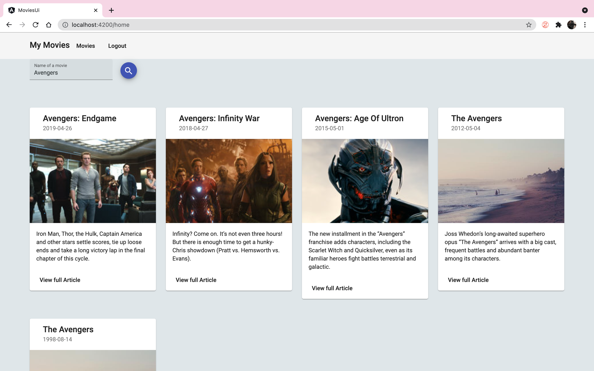
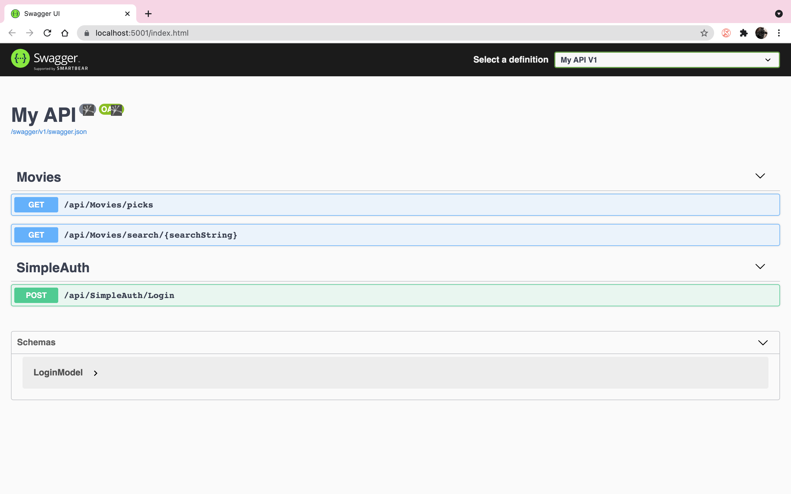

# OsirisAssessment

## Frameworks
- C#
- .Net Core
- JWT Authentication
- xUnit
- Angular and Angular Material
- IMemoryCache

## Runnning
- Run both api and ui projects
    - API dotnet run
    - UI ng serve
- If base api endpoint changes for some reason, please update in the environment.ts
- You can login by entering any username, this is simply so we can generate jwt.

## Swagger
- Go to https://localhost:5001/swagger/index.html to see endpoints

## Unit test
- Unit tests are using some json files to simiulate tests

## Cors
- If cors errors occur, refer to startup.cs in api project

## Screenshots

